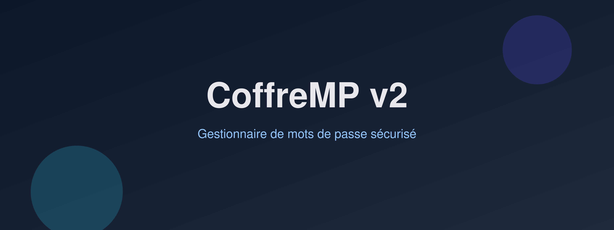
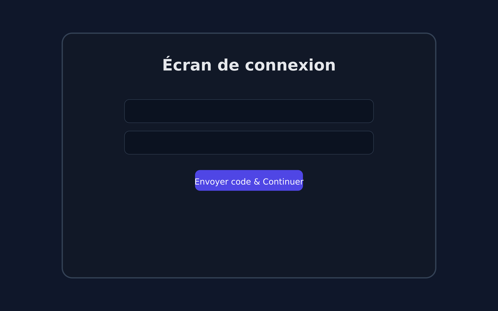
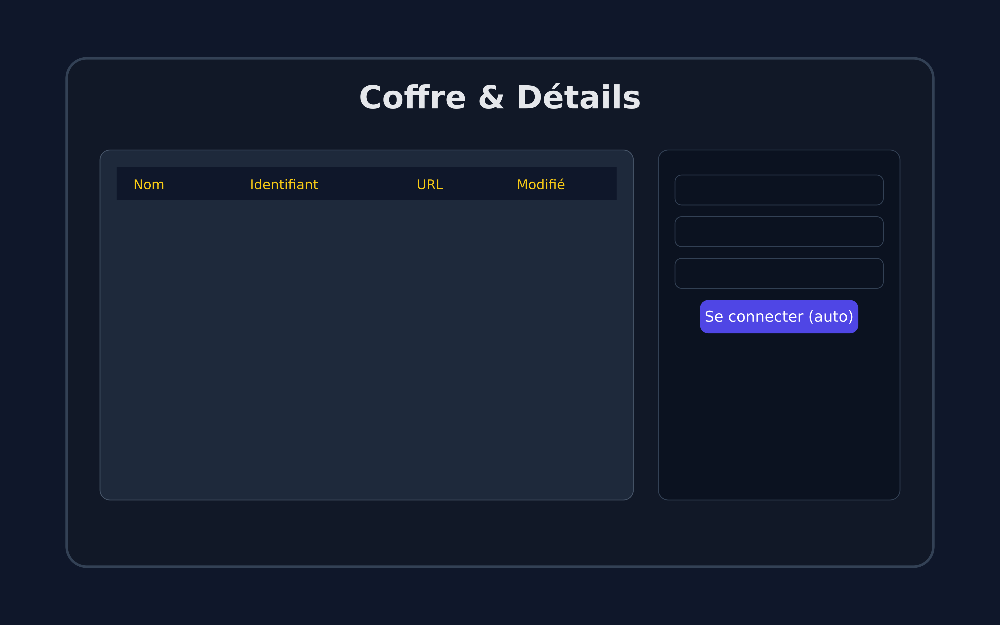

# CoffreMP v2 — Gestionnaire de mots de passe sécurisé

  

  
  
  
  

  

> **CoffreMP v2** est un gestionnaire de mots de passe **100% local**, avec **double authentification par e-mail (OTP)**, **chiffrement fort (Argon2id + Fernet)**, **auto-login (Selenium)** et une interface moderne.  
> Téléchargez, lancez : **pas de cloud, vos données restent chez vous**.

---

## 🧭 Sommaire

- [Fonctionnalités](#-fonctionnalités)
- [Aperçu](#-aperçu)
- [Téléchargement](#-téléchargement)
- [Prise en main rapide](#-prise-en-main-rapide)
- [Sécurité & confidentialité](#-sécurité--confidentialité)
- [Emplacement des données](#-emplacement-des-données)
- [Pré-requis auto-login](#-pré-requis-auto-login)
- [Dépannage](#-dépannage)
- [Checksums](#-checksums)
- [Roadmap](#-roadmap)
- [Contribuer](#-contribuer)
- [Licence](#-licence)

---

## ✨ Fonctionnalités

<table>
<tr>
<td width="33%">
<b>🔐 Chiffrement sérieux</b> 
Coffre chiffré en <b>Fernet (AES + HMAC)</b>. Clé dérivée par <b>Argon2id</b> avec sel aléatoire.
</td>
<td width="33%">
<b>📧 2FA par e-mail (OTP)</b> 
À chaque connexion, un <b>code à 6 chiffres</b> est requis (valide 5 min).
</td>
<td width="33%">
<b>⚡ Auto-login</b> 
Ouvre le site, remplit <b>login + mot de passe</b>, tente la connexion (via Selenium).
</td>
</tr>
<tr>
<td>
<b>🗂️ Gestion simple</b> 
Nom, identifiant, mot de passe (générateur), URL, notes, recherche instantanée.
</td>
<td>
<b>📋 Copie protégée</b> 
Effacement automatique du presse-papiers après délai (20s par défaut).
</td>
<td>
<b>💾 Sauvegardes</b> 
Export / import <i>toujours chiffré</i> pour déplacer votre coffre en toute sécurité.
</td>
</tr>
</table>

---

## 👀 Aperçu

  
  

---

## 🔽 Téléchargement

- **Windows (EXE autonome)**  
  👉 **[Télécharger CoffreMP v2](https://coffrefort.ilyox.fr/)**  
 
**Vérifier l’intégrité (recommandé)**
## 🧱 Sécurité & confidentialité

- Le mot de passe maître n’est jamais stocké (seul un hash Argon2id + sel est conservé pour la vérification).

- Le coffre (vault.json) est intégralement chiffré (Fernet).

- L’OTP est en mémoire uniquement et expire après 5 minutes.

- Aucune donnée n’est synchronisée ni collectée — seul l’e-mail OTP transite.

**⚠️ Si vous perdez votre mot de passe maître, il est impossible de récupérer vos données (c’est voulu, par sécurité).**

**🔐 Pour des raisons de sécurité , tout est stocké localement 

 
